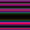

## ASCII Generator

Tool to generate ascii data over a grid with various generation options. This tools is mainly to generate test data.

## Installation

- You can download and set up Go langage by downloading it here: https://golang.org/dl/
- Use go get or download the files directly from github to get the project
- Set your GOPATH (to the project location) and GOROOT (where Go is installed) environment variables.

## Build and usage

```
@gotools $ go install asciigen
@gotools $ bin/asciigen.exe -h
@gotools $ bin/asciigen.exe -cell 10 -filename test.asc -freq 10 -xstep 0.1 -ystep 0.1
```

The generated image looks like this:


